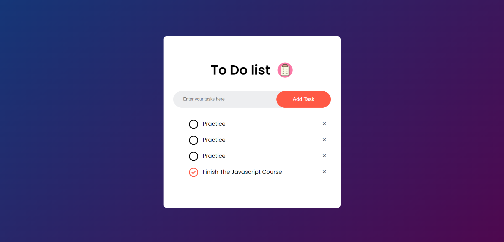

# To-Do List App

This is a simple and elegant To-Do List application built using HTML, CSS, and JavaScript. It allows users to add, check off, and delete tasks with ease. All tasks are saved to the local storage, so they persist even when the browser is refreshed.

## Features

- **Add Tasks**: Users can add tasks by typing in the input field and clicking the "Add Task" button.
- **Check/Uncheck Tasks**: Users can mark tasks as completed by clicking the checkbox next to each task. Completed tasks are visually differentiated with a strikethrough.
- **Delete Tasks**: Users can delete tasks by clicking the "X" button next to each task.
- **Persistent Storage**: Tasks are saved in the browser's local storage, ensuring that they are not lost when the page is refreshed or reopened.

## Usage

1. **Add a Task**: Enter your task in the input field and click "Add Task". Your task will appear in the list below.
2. **Complete a Task**: Click the checkbox next to a task to mark it as completed. The task will be crossed out.
3. **Delete a Task**: Click the "X" button next to a task to remove it from the list.

## Local Storage

All tasks are stored in the browser's local storage, meaning that your tasks will remain even after refreshing the page or closing the browser. To clear the list, you can either delete tasks individually or clear the local storage manually.

## Screenshot

### Links

- Repo URL: [github link](https://github.com/Yussif20/todo_list)
- Live Site URL: [live site url](https://yussif20.github.io/todo_list/)

## Installation

No installation is required. Simply open the `index.html` file in any modern web browser, and the app will be ready to use.

## Contributing

Feel free to fork this repository and submit pull requests. Contributions are welcome!
